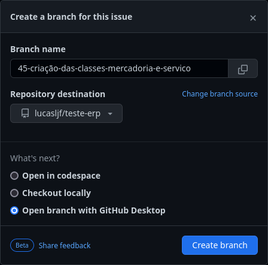

# Projeto ERP

## Interagindo com issues
Ao notar uma issue que deseje resolver, faça um comentário informando seu interesse.

O professor fará a sua atribuição a esta tarefa.

Na página do projeto no GitHub e visualizando a issue, clique no link **Create a branch for this issue or link a pull request**.

Após, marque a opção **Open branch with GitHub Desktop** e clique em **Create Branch**.

## Software utilizado

- NetBeans - [https://netbeans.apache.org/front/main/download/](https://https://netbeans.apache.org/front/main/download/)
- GitHub Desktop - [Windows/Mac](https://https://desktop.github.com/) ou [Linux](https://github.com/shiftkey/desktop/releases/tag/release-3.3.8-linux2)
- PlantUML - [https://plantuml.com/](https://https://plantuml.com/)
