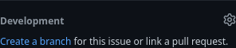

# Projeto ERP

## Interagindo com issues
Ao notar uma issue que deseje resolver, faça um comentário informando seu interesse.

O professor fará a sua atribuição a esta tarefa.

Na página do projeto no GitHub e visualizando a issue, clique no link **Create a branch for this issue or link a pull request**.

Após, marque a opção **Open branch with GitHub Desktop** e clique em **Create Branch**.

